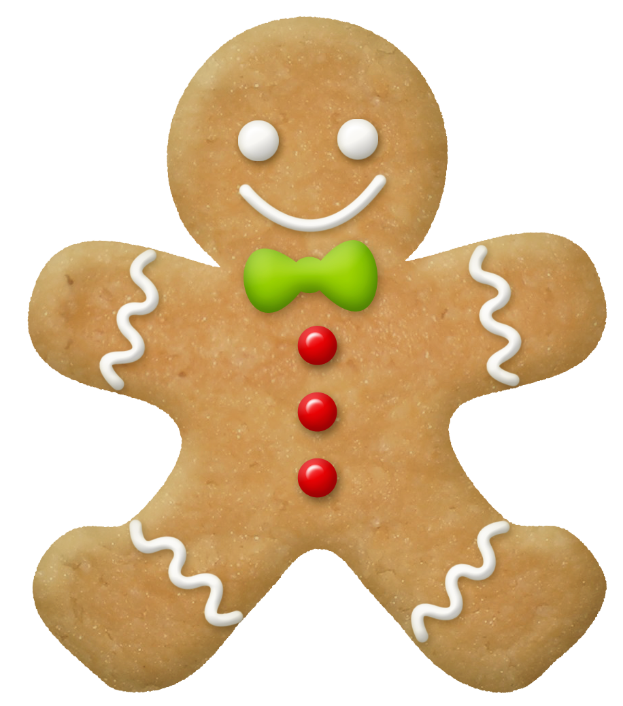

<div id="top"></div>
<!--
*** Thanks for checking out the Best-README-Template. If you have a suggestion
*** that would make this better, please fork the repo and create a pull request
*** or simply open an issue with the tag "enhancement".
*** Don't forget to give the project a star!
*** Thanks again! Now go create something AMAZING! :D
-->


<!-- PROJECT SHIELDS -->
<!--
*** I'm using markdown "reference style" links for readability.
*** Reference links are enclosed in brackets [ ] instead of parentheses ( ).
*** See the bottom of this document for the declaration of the reference variables
*** for contributors-url, forks-url, etc. This is an optional, concise syntax you may use.
*** https://www.markdownguide.org/basic-syntax/#reference-style-links
-->
[![Contributors][contributors-shield]][contributors-url]
[![Forks][forks-shield]][forks-url]
[![Stargazers][stars-shield]][stars-url]
[![Issues][issues-shield]][issues-url]
[![MIT License][license-shield]][license-url]
[![LinkedIn][linkedin-shield]][linkedin-url]


<!-- PROJECT LOGO -->
<br />
<div align="center">
  <a href="https://github.com/hcduffey/candyland">
    
  </a>

<h3 align="center">Candyland</h3>

  <p align="center">
    A simple browser-based game
    <br />
    <a href="https://github.com/hcduffey/candyland"><strong>Explore the code »</strong></a>
    <br />
    <br />
    <a href="https://hcduffey.github.io/candyland/">View Demo</a>
    ·
    <a href="https://github.com/hcduffey/candyland/issues">Report Bug</a>
    ·
    <a href="https://github.com/hcduffey/candyland/issues">Request Feature</a>
  </p>
</div>


<!-- TABLE OF CONTENTS -->
<details>
  <summary>Table of Contents</summary>
  <ol>
    <li>
      <a href="#about-the-project">About The Project</a>
      <ul>
        <li><a href="#built-with">Built With</a></li>
      </ul>
    </li>
    <li>
      <a href="#getting-started">Getting Started</a>
      <ul>
        <li><a href="#prerequisites">Prerequisites</a></li>
        <li><a href="#installation">Installation</a></li>
      </ul>
    </li>
    <li><a href="#usage">Usage</a></li>
    <li><a href="#roadmap">Roadmap</a></li>
    <li><a href="#contributing">Contributing</a></li>
    <li><a href="#license">License</a></li>
    <li><a href="#contact">Contact</a></li>
    <li><a href="#acknowledgments">Acknowledgments</a></li>
  </ol>
</details>


<!-- ABOUT THE PROJECT -->
## About The Project

[![Product Name Screen Shot][product-screenshot]](images/screen_shot.png)

Candyland is a classic board game that was first published in 1949. Its aim is to provide a fun game that young children can play without knowing how to count or read.

<p align="right">(<a href="#top">back to top</a>)</p>

### Built With

* [W3CSS](https://www.w3schools.com/w3css/)
* [JQuery](https://jquery.com)

<p align="right">(<a href="#top">back to top</a>)</p>

<!-- GETTING STARTED -->
## Getting Started

To get a local copy up and running follow these simple steps.

### Prerequisites

There are no prerequisites.

### Installation

1. Clone the repo
   ```sh
   git clone https://github.com/hcduffey/candyland.git
   ```
2. Open index.html in your browser

<p align="right">(<a href="#top">back to top</a>)</p>


<!-- USAGE EXAMPLES -->
## Usage

The page loads with the game ready to play and set to Player 1's turn. Moves are made by first clicking the "Draw" button to draw a card. That player then clicks the nearest gameboard square to their game piece that matches the color of the square on the drawn card. The first player to make it to the end of the board wins.

Click the Reset button at any time to start a new game.

### Shortcut through Gumdrop Pass

If a player lands on the purple square nearest Gum Drop Pass, their game piece advances through the "shortcut" through the secret path illustrated by the dotted lined squares.

### Winning the Game

The first player to reach the Candy Castle at the end of the board wins the game. Note: the Candy Castle square can be any color.

<p align="right">(<a href="#top">back to top</a>)</p>


<!-- ROADMAP -->
## Roadmap

- [ ] Create an "Licorice Square" that causes the player to lose a turn if they land on it
- [ ] Add double-square cards that enable players to move to the second square of that color instead of the first
- [ ] Make the interface responsive so that it can be played on smaller screens

See the [open issues](https://github.com/hcduffey/candyland/issues) for a full list of proposed features (and known issues).

<p align="right">(<a href="#top">back to top</a>)</p>


<!-- CONTRIBUTING -->
## Contributing

Contributions are what make the open source community such an amazing place to learn, inspire, and create. Any contributions you make are **greatly appreciated**.

If you have a suggestion that would make this better, please fork the repo and create a pull request. You can also simply open an issue with the tag "enhancement".
Don't forget to give the project a star! Thanks again!

1. Fork the Project
2. Create your Feature Branch (`git checkout -b feature/AmazingFeature`)
3. Commit your Changes (`git commit -m 'Add some AmazingFeature'`)
4. Push to the Branch (`git push origin feature/AmazingFeature`)
5. Open a Pull Request

<p align="right">(<a href="#top">back to top</a>)</p>


<!-- LICENSE -->
## License

Distributed under the MIT License. See `LICENSE.txt` for more information.

<p align="right">(<a href="#top">back to top</a>)</p>


<!-- CONTACT -->
## Contact

Cliff Duffey - [@cliffduffey2](https://twitter.com/cliffduffey2)

Project Link: [https://github.com/hcduffey/candyland](https://github.com/hcduffey/candyland)

<p align="right">(<a href="#top">back to top</a>)</p>


<!-- ACKNOWLEDGMENTS -->
## Acknowledgments

* [Pixabay Images](https://pixabay.com/)
* [Google Fonts](https://fonts.google.com/)
* [Best-README-Template](https://github.com/othneildrew/Best-README-Template)

<p align="right">(<a href="#top">back to top</a>)</p>


<!-- MARKDOWN LINKS & IMAGES -->
<!-- https://www.markdownguide.org/basic-syntax/#reference-style-links -->
[contributors-shield]: https://img.shields.io/github/contributors/hcduffey/candyland.svg?style=for-the-badge
[contributors-url]: https://github.com/hcduffey/candyland/graphs/contributors
[forks-shield]: https://img.shields.io/github/forks/hcduffey/candyland.svg?style=for-the-badge
[forks-url]: https://github.com/hcduffey/candyland/network/members
[stars-shield]: https://img.shields.io/github/stars/hcduffey/candyland.svg?style=for-the-badge
[stars-url]: https://github.com/hcduffey/candyland/stargazers
[issues-shield]: https://img.shields.io/github/issues/hcduffey/candyland.svg?style=for-the-badge
[issues-url]: https://github.com/hcduffey/candyland/issues
[license-shield]: https://img.shields.io/github/license/hcduffey/candyland.svg?style=for-the-badge
[license-url]: https://github.com/hcduffey/candyland/blob/master/LICENSE.txt
[linkedin-shield]: https://img.shields.io/badge/-LinkedIn-black.svg?style=for-the-badge&logo=linkedin&colorB=555
[linkedin-url]: https://linkedin.com/in/cduffey
[product-screenshot]: images/screen_shot.png
