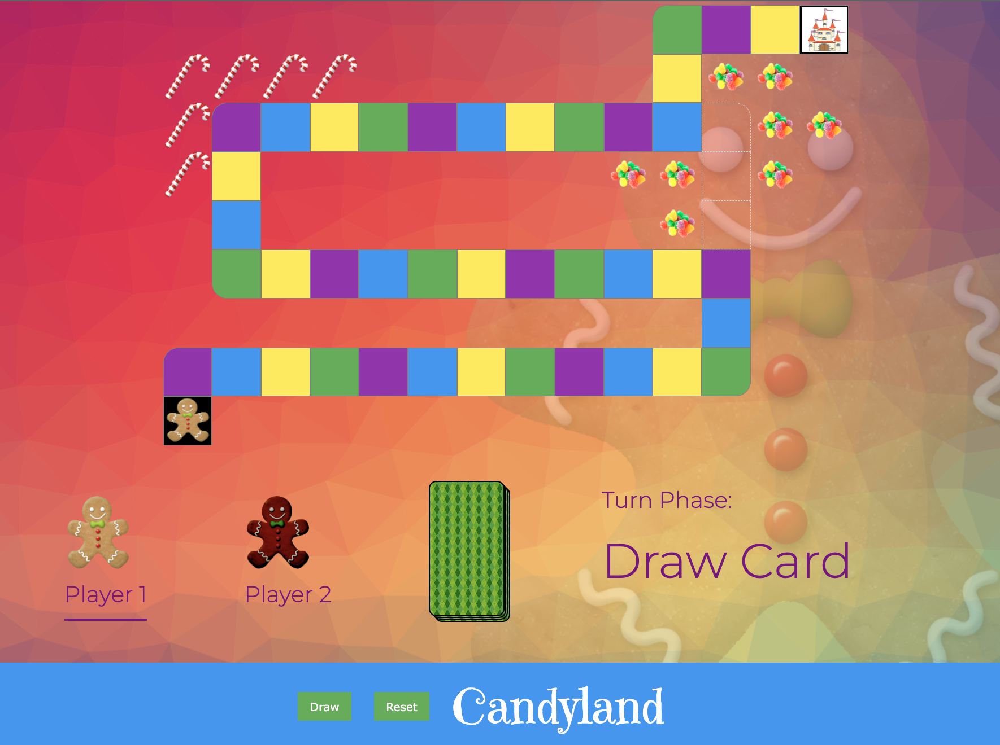
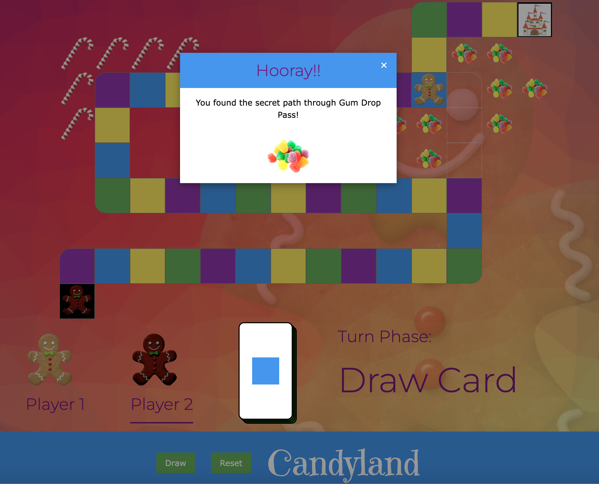
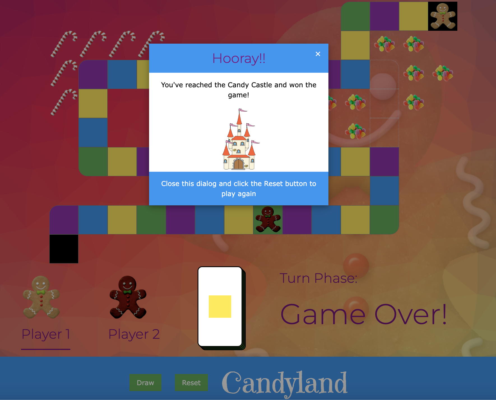
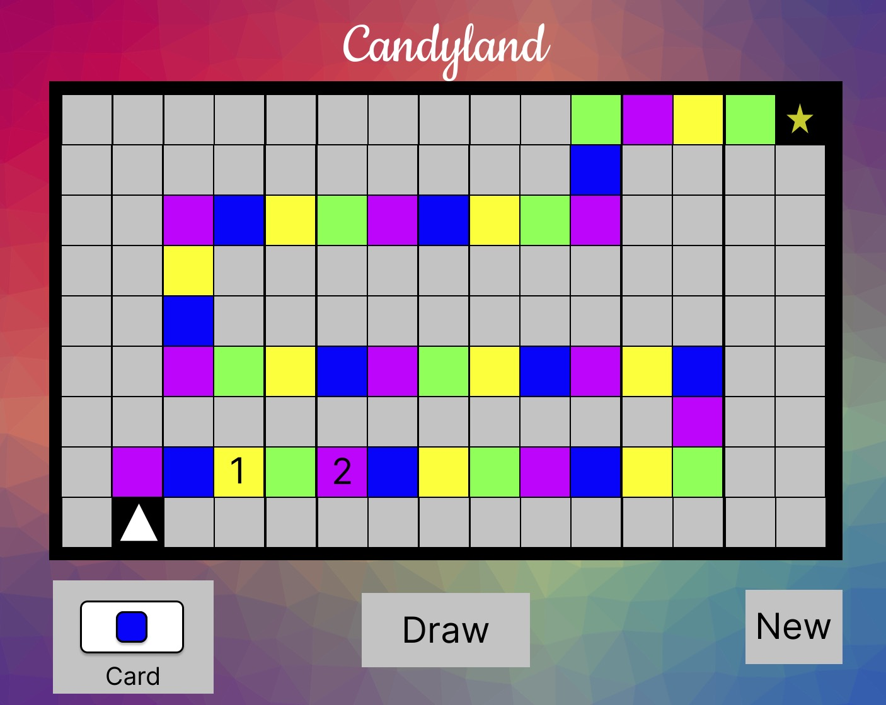

# Candyland

## Project Overview

A simple browser-based version of the Candyland game. Candlyland is a classic board game that was first published in 1949. Its aim is to provide a fun game that young children can play without knowing how to count.

## Getting Started

The game can be accessed at https://hcduffey.github.io/candyland/.

The page loads with the game ready to play and set to Player 1's turn. Moves are made by clicking a "Draw" button to draw a card. That player then clicks the nearest gameboard square to their game piece that matches the color of the square on the drawn card. The first player to make it to the end of the board wins.

Click the Reset button at any time to start a new game.

### Shortcut through Gumdrop Pass

If a player lands on the purple square nearest Gum Drop Pass, their game piece advances through the "shortcut" through the Pass illustrated by the dotted lined squares.

### Winning the Game

The first player to reach the Candy Castle at the end of the board wins the game. Note: the Candy Castle square is any color.

## Screenshots

_Main Screen_

_Found the Secret Path_

_Won the Game_

## Technologies Used

- HTML
- CSS (W3CSS Framework)
- Javascript (JQuery)

## Install

The game can also be installed locally:

1. Clone the source from Github
2. View index.html in a browser

## Next Steps

Planned future enhancements include:

- Creat an "Licourice Square" that causes the player to lose a turn if the land on it
- Allow users to customize their game token
- Add double-square cards that enable players to move to the second square of that color instead of the first

***

## Wireframes

_Main Screen Wireframe_

## User Stories

1. As a user, I want to be able to start a new game at any time.

2. As a user, I want to play a turn by drawing a card and moving my game piece to the next corresponding color square.

3. As a user, I want my opponent to play a turn after me.

4. As a user, I want to see a celebratory message when I win the game by reaching the final square.

### MVP Goals

1. As a user, I want start a new game by clicking a New button. This will bring all player pieces back to Start.

2. As a user, I want to play a turn by clicking a Draw button to have my game piece moved to the corresponing color square on the card.

3. As a user, I want to play against a friend in 2 player mode.

4. As a user I want to win the game by landing on the Star Square at the end of the board (which will be reached by any color).

### Stretch Goals

1. As a user, I want to be required to correctly choose the square indicated by the card before my game piece is moved to it.

2. As a user, I want to have a chance to draw "double square" cards that allow me to move to the second square of that color.

3. As a user, I want the possibility of landing on a "Licourice Space" that makes the player stuck for one turn to make the game more exciting.
